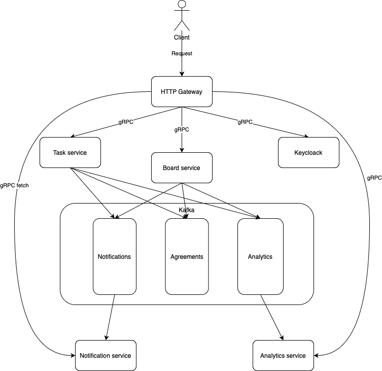

# Motion - Kanban Board Service

Предполагается разработка системы для взаимодействия с досками-канбан, при помощи которых можно управлять задачами и планировать дальнейшие действия по достижению какой-то конкретной цели.

## Доменная область

Домен будет состоять из следующих сущностей:

- Таска/задача
- Канбан-доска
- Согласования
- Пользователь
- Уведомления

Каждая таска относится **только** к одной канбан-доске, каждая канбан-доска может содержать множество различных тасок (one-to-many). \
У каждой канбан-доски имеется определенный список пользователей, которые могут получить к ней доступ и права, соответствующие роли пользователя на доске.

## Сервисы и бизнес-процессы системы

Выделяются следующие бизнес-процессы:

- Идентификация, аутентификация и авторизация пользователей (keycloack)
- Создание, редактирование тасок (сервис тасок)
- Создание, редактирование канбан-досок (сервис досок)
- Хранение и рассылка уведомлений (сервис уведомлений)

1) HTTP Gateway, распределяет запросы по сервисам

2) keycloak для аутентификации

2) Сервис тасок - это планирование (первичный сервис в жизни проекта), в это входит
  - создание новых тасок
  - редактирование тасок (поля редактирования будут указаны в ручках)
  - добавление таске зависимость от других \
Изменения в этом сервисе перетекают через кафку в сервис досок, сервис аналитики, сервис согласования и сервис нотификаций

4) Сервис досок - это распределение задач по топикам (вторичный сервис в жизни проекта), в это входит
  - создание новых досок
  - редактирование досок (добавление в доску задач из пула уже имеющихся и согласованных [про согласование см. далее], добавление различных топиков - например: backlog, todo, in progress, done)

5) Сервис согласований - после планирования новые задачи отправляются на согласование в этот сервис, где менеджеры рассматривают изменения в плане, а затем аппрувают или отклоняют их

6) Сервис аналитики
  - позволяет собирать данные о прогрессе проекта (затраченное время, самые "горячие" задачи, ...)
  - для задач с зависимостями: позволяет наглядно посмотреть, какие задачи блокируют прогресс и какие требуется выполнить, чтоб дойти до текущей задачи

7) Сервис нотификаций - хранение и рассылка
 [ имеет смысл только после создания UI, при помощи которого можно автоматически запрашивать различные уведомления без мануального дерганья ручек ]

